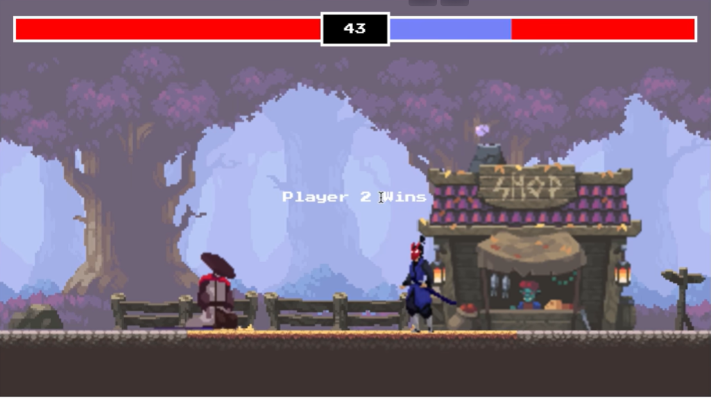

# Nome do Projeto

## 📌 Sobre o projeto

Este projeto foi desenvolvido pelo nosso grupo para a disciplina de [NOME DA DISCIPLINA].

O objetivo do projeto é [EXPLIQUE AQUI O QUE O PROJETO FAZ].

## 💻 Tecnologias utilizadas

- HTML5
- CSS3
- JavaScript
- Git
- GitHub

## 🎨 Protótipo

O protótipo do projeto foi desenvolvido utilizando [FIGMA/OUTRA FERRAMENTA].

### Imagem do protótipo



### Link do protótipo

[🔗 Acessar protótipo](COLOQUE_AQUI_O_LINK)

## 👥 Integrantes

### Integrante 1

**Nome:** Nome do aluno

**GitHub:** [@usuario](LINK_DO_GITHUB)

### Integrante 2

**Nome:** Nome do aluno

**GitHub:** [@usuario](LINK_DO_GITHUB)

### Integrante 3

**Nome:** Nome do aluno

**GitHub:** [@usuario](LINK_DO_GITHUB)

### Integrante 4

**Nome:** Nome do aluno

**GitHub:** [@usuario](LINK_DO_GITHUB)

## 📂 Estrutura do projeto

```text
projeto-grupo/
│
├── README.md
│
└── imagens/
    └── prototipo.png
